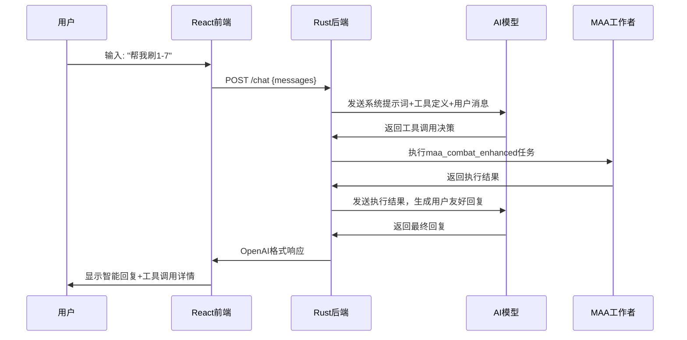

# MAA 智能控制中间层

基于 AI Function Calling 的明日方舟全自动化控制系统。通过智能对话让大模型直接控制明日方舟游戏，支持16个MAA功能工具，提供完整的游戏自动化解决方案。

[](https://www.rust-lang.org)
[](LICENSE)
[](https://github.com/MaaAssistantArknights/MaaAssistantArknights)
[](https://playcover.io/)

## 功能特性

### 核心能力
- **智能对话控制**: 通过自然语言与MAA助手对话，实现游戏自动化
- **17个专业工具**: 覆盖启动、刷图、招募、基建、肉鸽、截图等MAA功能
- **Web聊天界面**: React前端，支持实时对话和工具调用展示
- **深度游戏理解**: 基于MAA知识库的智能任务分析和执行策略
- **PlayCover支持**: 自动TouchMode配置，解决iOS模拟截图问题

### 技术特性
- **AI Function Calling**: 大模型自主决策工具调用，智能任务链执行
- **异步任务队列**: HTTP + 单线程MAA工作者，保证状态一致性
- **多AI提供商**: OpenAI、Azure、通义千问、Kimi、Ollama支持
- **双运行模式**: 开发模式(Stub) + 生产模式(真实MAA)

### 设备支持
- PlayCover: macOS iOS应用模拟器
- Android模拟器: BlueStacks、NoxPlayer、LDPlayer
- Android真机: USB或无线ADB连接

## 系统架构

```
┌─────────────────┐    ┌──────────────┐    ┌────────────────┐
│   Axum 异步     │    │   消息队列    │    │  MAA单线程工作者 │
│   HTTP 服务器   │───▶│    (MPSC)    │───▶│   (独占MAA实例) │
│ (多请求并发处理) │    │              │    │                │
└─────────────────┘    └──────────────┘    └────────────────┘
```

**架构优势**:
- **零锁设计**: 避免 Arc<Mutex<>> 的死锁和竞态条件
- **高性能**: 消息传递比锁机制更高效
- **易调试**: 清晰的消息流，可追踪的执行路径
- **状态一致**: MAA实例状态始终保持一致性

## 快速开始

### 环境要求

- **Rust**: 1.70+ 
- **MAA.app**: macOS 系统安装版本 (用于真实模式)
- **PlayCover**: iOS 应用模拟器 (可选)
- **Node.js**: 18+ (Web UI 前端)

### 1. 克隆项目

```bash
git clone --recursive https://github.com/your-repo/maa-remote-server.git
cd maa-remote-server
```

### 2. 环境配置

项目采用分层配置系统 - TOML配置文件 + 环境变量：

```bash
cp .env.example .env
# 编辑 .env 文件，配置 MAA 路径和 AI API
```

关键配置项：
```bash
# MAA Core 动态库 (系统MAA.app)
MAA_CORE_LIB=/Applications/MAA.app/Contents/Frameworks/libMaaCore.dylib
MAA_RESOURCE_PATH=/Applications/MAA.app/Contents/Resources
DYLD_LIBRARY_PATH=/Applications/MAA.app/Contents/Frameworks

# 设备连接
MAA_DEVICE_ADDRESS=127.0.0.1:1717  # PlayCover
# MAA_DEVICE_ADDRESS=127.0.0.1:5555  # Android 模拟器

# AI 配置
AI_PROVIDER=qwen
AI_API_KEY=your-api-key-here
```

配置文件结构:
- `config/app.toml` - 主配置文件（默认值和选项定义）
- `.env` - 环境变量（运行时配置覆盖）
- `.env.example` - 配置模板

详细配置说明请参考：[配置文档](docs/CONFIGURATION.md)

### 3. 运行服务器

**开发模式** (模拟MAA功能):
```bash
cargo run --no-default-features --features stub-mode
```

**生产模式** (真实MAA集成，默认):
```bash
cargo run --bin maa-intelligent-server
```

### 4. 启动前端界面

安装前端依赖:
```bash
cd maa-chat-ui
npm install
```

启动开发服务器:
```bash
npm run dev
# 前端将在 http://localhost:3000 启动
```

构建生产版本 (可选):
```bash
npm run build
npm run preview  # 预览生产构建
```

### 5. 测试连接

后端API测试:
```bash
# 健康检查
curl http://localhost:8080/health

# 获取 Function Calling 工具列表
curl http://localhost:8080/tools

# 执行 MAA 任务
curl -X POST http://localhost:8080/call \
  -H "Content-Type: application/json" \
  -d '{
    "function_call": {
      "name": "maa_startup", 
      "arguments": {
        "client_type": "Official",
        "start_app": false
      }
    }
  }'
```

前端界面测试:
```bash
# 访问聊天界面
open http://localhost:3000

# 测试智能对话
# 在聊天框输入："帮我启动游戏"
# 系统将自动调用 maa_startup 工具
```

## 🌐 前后端交互协议

### 系统架构图
```
┌─────────────────┐    ┌──────────────────┐    ┌─────────────────┐
│   React前端     │    │   Axum后端       │    │   MAA工作线程   │
│   (端口3000)    │◄──►│   (端口8080)     │───►│   (任务队列)    │
└─────────────────┘    └──────────────────┘    └─────────────────┘
        │                      │                        │
   用户输入对话           AI智能分析调用              执行真实MAA任务
   实时界面展示           Function Calling           回调状态更新
```

### 聊天接口协议

**前端请求格式**:
```typescript
POST /chat
Content-Type: application/json

{
  "messages": [
    {"role": "user", "content": "帮我刷5次1-7关卡，我需要经验书"}
  ]
}
```

**后端响应格式** (OpenAI兼容):
```json
{
  "choices": [{
    "message": {
      "role": "assistant",
      "content": "✅ 已成功为您执行战斗任务\n\n📊 执行结果：\n- 关卡：1-7\n- 完成次数：5次\n- 消耗理智：30\n- 获得经验书：150个\n\n💡 建议：经验书储量充足，可以升级干员了！",
      "tool_calls": [
        {
          "function": {
            "name": "maa_combat_enhanced",
            "arguments": "{\"stage\":\"1-7\",\"battle_count\":5}"
          }
        }
      ]
    }
  }]
}
```

### Function Calling工作流程



## 🔧 Function Calling 工具

### 核心游戏功能 (4个)
- `maa_startup` - 游戏启动和账号管理
- `maa_combat_enhanced` - 自动战斗和资源管理  
- `maa_recruit_enhanced` - 智能公开招募
- `maa_infrastructure_enhanced` - 基建自动化

### 高级自动化 (4个)
- `maa_roguelike_enhanced` - 集成战略(肉鸽)
- `maa_copilot_enhanced` - 作业执行
- `maa_sss_copilot` - 保全派驻
- `maa_reclamation` - 生息演算

### 辅助功能 (4个)
- `maa_rewards_enhanced` - 奖励收集
- `maa_credit_store_enhanced` - 信用商店
- `maa_depot_management` - 仓库管理  
- `maa_operator_box` - 干员管理

### 系统功能 (5个)
- `maa_closedown` - 游戏关闭
- `maa_custom_task` - 自定义任务
- `maa_video_recognition` - 视频识别
- `maa_system_management` - 系统管理
- `maa_take_screenshot` - 游戏截图

## 📱 PlayCover 设置指南

### 1. 安装 PlayCover
```bash
brew install --cask playcover-nightlybuild
```

### 2. 安装明日方舟
1. 下载明日方舟 IPA 文件
2. 在 PlayCover 中安装 IPA
3. 启用 **MaaTools** 插件

### 3. 配置连接
```bash
# .env 文件配置
MAA_DEVICE_ADDRESS=127.0.0.1:1717  # PlayCover 固定端口

# 系统会自动:
# - 检测 PlayCover 连接
# - 设置 TouchMode 为 MacPlayTools  
# - 配置 iOS 平台差异资源
```

### 4. 验证连接
启动明日方舟后，运行：
```bash
curl -X POST http://localhost:8080/call \
  -H "Content-Type: application/json" \
  -d '{
    "function_call": {
      "name": "maa_startup",
      "arguments": {"client_type": "Official", "start_app": false}
    }
  }'
```

成功连接会显示设备 UUID 和游戏识别信息。

## 🔍 API 参考

### HTTP 接口

| 端点 | 方法 | 功能 |
|------|------|------|
| `/health` | GET | 健康检查 |
| `/tools` | GET | 获取 Function Calling 工具定义 |
| `/call` | POST | 执行 MAA 任务 (直接调用) |
| `/chat` | POST | 智能对话接口 (AI决策调用) |
| `/status` | GET | 获取 MAA 状态信息 |

### 智能对话 vs 直接调用

**智能对话接口** (`/chat`) - **推荐方式**:
- 🤖 AI自主分析用户需求
- 🧠 智能选择合适的工具和参数
- 📝 提供专业的执行建议和结果解读
- 🔄 支持多工具任务链执行

**直接调用接口** (`/call`) - 开发调试:
- ⚡ 直接执行指定工具
- 🔧 适合API集成和自动化脚本
- 📊 返回原始执行结果

### Function Calling 格式

```json
{
  "function_call": {
    "name": "maa_combat_enhanced",
    "arguments": {
      "stage": "1-7",
      "strategy": {
        "target_value": 10,
        "medicine": 999,
        "stone": 0
      }
    }
  }
}
```

### 响应格式

```json
{
  "success": true,
  "result": {
    "status": "success",
    "message": "任务执行完成",
    "details": {
      "stage": "1-7",
      "completedRuns": 10,
      "resourcesGained": {...}
    }
  },
  "backend": "singleton",
  "timestamp": "2025-08-19T14:15:32Z"
}
```

## 📊 性能指标

| 指标 | 数值 | 说明 |
|------|------|------|
| HTTP 并发处理 | 1000+ QPS | Axum 异步处理 |
| MAA 任务执行 | 串行处理 | 保证状态一致性 |
| 响应延迟 | <100ms | 消息队列开销 <1ms |
| 内存占用 | ~50MB | 单 MAA 实例 |
| CPU 使用率 | 低 | 无锁竞争 |

## 🔧 故障排除

### 常见问题

#### 1. PlayCover 连接失败
```
错误: PlayCover连接失败: Connection refused

解决方案:
1. 确保 PlayCover 已安装明日方舟
2. 确保 MaaTools 已启用
3. 确保游戏正在运行
4. 检查端口 1717 是否被占用
```

#### 2. MAA 库加载失败
```
错误: 加载 MAA Core 库失败

解决方案:
1. 检查 MAA.app 是否已安装
2. 验证 MAA_CORE_LIB 环境变量路径
3. 确保 DYLD_LIBRARY_PATH 设置正确
```

#### 3. 截图或识别异常
```
错误: 模板匹配失败或截图为空

解决方案:
1. 确认游戏界面可见且未被遮挡
2. 检查设备分辨率是否支持
3. 验证 TouchMode 设置 (已自动处理)
```

### 调试技巧

**启用详细日志**:
```bash
LOG_LEVEL=debug cargo run --bin maa-intelligent-server
```

**查看 MAA 回调**:
日志中会显示详细的 MAA 事件信息，包括连接状态、任务执行、识别结果等。

**健康检查**:
```bash
curl http://localhost:8080/health | jq
curl http://localhost:8080/status | jq
```

## 📁 项目结构

```
maa-remote-server/
├── src/
│   ├── bin/
│   │   └── maa-intelligent-server.rs  # 🚀 服务器入口
│   ├── maa_core/                      # 🎯 MAA Core 模块
│   │   ├── mod.rs                     # 实例管理和回调
│   │   ├── worker.rs                  # ⭐ 单线程工作者
│   │   ├── task_queue.rs              # ⭐ 任务队列定义
│   │   └── basic_ops.rs               # 废弃API兼容
│   ├── function_tools/                # 🔧 Function Calling
│   │   ├── server.rs                  # 增强服务器
│   │   ├── queue_client.rs            # 队列客户端
│   │   ├── core_game.rs               # 4个核心工具
│   │   ├── advanced_automation.rs     # 4个高级工具
│   │   ├── support_features.rs        # 4个辅助工具
│   │   └── system_features.rs         # 4个系统工具
│   └── ai_client/                     # 🤖 AI 集成
├── docs/                              # 📚 技术文档
│   ├── architecture/                  # 架构设计
│   └── modules/                       # 模块文档
├── maa-chat-ui/                       # 💬 Web UI
└── scripts/                           # 🔧 部署脚本
```

## 🛠️ 开发指南

### 添加新的 Function Tool

1. 在对应模块文件中添加工具定义
2. 实现工具逻辑，使用 `MaaQueueClient`
3. 在 `mod.rs` 中注册工具
4. 更新文档和测试

### 扩展 MAA 任务类型

1. 在 `task_queue.rs` 中添加新的 `MaaTask` 变体
2. 在 `worker.rs` 中实现对应的处理逻辑
3. 在 `queue_client.rs` 中添加客户端方法

### 集成新的 AI 提供商

1. 在 `ai_client/providers/` 中添加提供商实现
2. 实现 `AiProvider` trait
3. 在配置文件中添加相关环境变量

## 📄 技术文档

- [配置说明文档](docs/CONFIGURATION.md) - 完整的配置系统说明
- [系统架构文档](docs/architecture/SYSTEM_ARCHITECTURE.md)
- [MAA Core 模块](docs/modules/MAA_CORE.md)
- [Function Tools 模块](docs/modules/FUNCTION_TOOLS.md)
- [AI Client 模块](docs/modules/AI_CLIENT.md)

## 🤝 贡献指南

1. Fork 项目
2. 创建特性分支: `git checkout -b feature/new-tool`
3. 提交更改: `git commit -am 'Add new MAA tool'`
4. 推送分支: `git push origin feature/new-tool`
5. 创建 Pull Request

## 📜 许可证

本项目基于 MIT 许可证开源。详见 [LICENSE](LICENSE) 文件。

## 🙏 致谢

- [MaaAssistantArknights](https://github.com/MaaAssistantArknights/MaaAssistantArknights) - 核心自动化引擎
- [PlayCover](https://playcover.io/) - macOS iOS 应用模拟器
- [Rust](https://rust-lang.org/) - 系统编程语言
- [Axum](https://github.com/tokio-rs/axum) - 现代异步 Web 框架

## 📖 使用示例

### Web界面智能对话示例

**日常任务**:
```
用户: "帮我做日常任务"
助手: 开始执行日常任务序列：奖励收集 → 基建管理 → 公开招募

✅ 奖励收集完成 - 获得合成玉200、龙门币15000
✅ 基建管理完成 - 收集材料、重新排班
✅ 公开招募完成 - 完成3次招募，获得新干员1个

💡 建议：理智即将满溢，推荐刷经验书或龙门币本
```

**战斗刷图**:
```
用户: "我想要经验书，帮我刷1-7直到理智用完"
助手: ✅ 已成功执行1-7关卡刷取

📊 执行结果：
- 完成次数：42次
- 消耗理智：126
- 获得经验书：126个
- 执行时间：约35分钟

💡 建议：经验书储量充足，可以升级核心干员了！
```

**肉鸽模式**:
```
用户: "帮我刷肉鸽，用指挥分队"
助手: 🃏 开始执行集成战略任务

📊 执行结果：
- 主题：傀影与猩红孤钻
- 分队：指挥分队
- 完成层数：15层
- 获得收藏品：猩红孤钻×3

💡 建议：表现优秀！可以尝试提高难度获得更多奖励
```

### 前端功能特性

**智能对话界面**:
- 📱 现代化响应式设计，支持移动端
- 💬 实时消息流，支持打字机效果
- 🔧 工具调用详情展示，透明化执行过程
- 📊 执行结果可视化，数据统计清晰
- 🎨 优雅的UI/UX设计，使用体验流畅

**技术栈**:
- **React 19**: 最新React版本，支持Concurrent特性
- **Vite 5**: 极速构建工具，热重载体验
- **TypeScript**: 类型安全，开发体验优秀
- **Tailwind CSS**: 实用优先的CSS框架
- **Lucide Icons**: 现代化图标库

---

**项目状态**: ✅ 积极维护 | **版本**: 1.0.0 | **最后更新**: 2025-08-20

## 🚀 快速启动命令

```bash
# 1. 克隆并启动后端
git clone --recursive https://github.com/your-repo/maa-remote-server.git
cd maa-remote-server
cp .env.example .env  # 编辑配置
cargo run --bin maa-intelligent-server

# 2. 启动前端 (新终端)
cd maa-chat-ui
npm install && npm run dev

# 3. 访问应用
open http://localhost:3000
```
