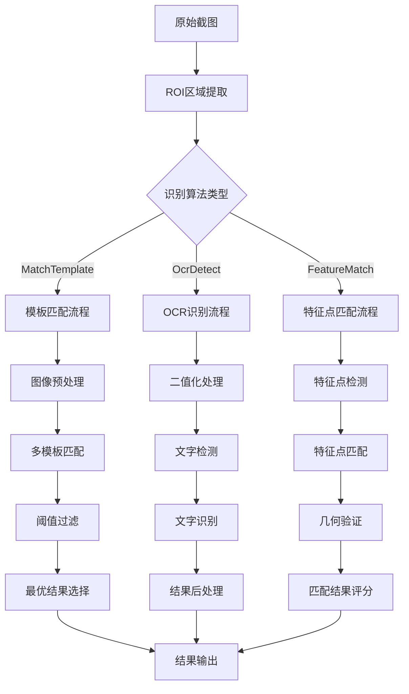

# MAA图像识别系统深度分析报告

## 概述

本文档基于对MAA官方仓库的深入分析，详细阐述了MAA图像识别系统的核心架构、关键算法和实现细节。MAA使用了一套完整的计算机视觉流水线，结合模板匹配、OCR文字识别和特征点匹配等多种技术，实现对《明日方舟》游戏界面的精确识别与自动化操作。

## 1. 核心架构概览

### 1.1 图像识别模块架构

```
┌─────────────────┐    ┌─────────────────┐    ┌─────────────────┐
│   VisionHelper  │────│   TaskConfig    │────│  ResourceMgr    │
│  (基础图像操作)  │    │   (任务配置)     │    │  (资源管理)      │
└─────────────────┘    └─────────────────┘    └─────────────────┘
          │                       │                       │
          ▼                       ▼                       ▼
┌─────────────────┬─────────────────┬─────────────────┬─────────────────┐
│    Matcher      │     OCRer       │ FeatureMatcher  │  MultiMatcher   │
│  (模板匹配)      │   (文字识别)     │  (特征点匹配)    │  (多目标匹配)    │
└─────────────────┴─────────────────┴─────────────────┴─────────────────┘
          │                       │                       │
          ▼                       ▼                       ▼
┌─────────────────┬─────────────────┬─────────────────┬─────────────────┐
│   OpenCV TM     │   PaddleOCR     │   SIFT/ORB      │   NMS算法        │
│  (模板匹配算法)  │  (深度学习OCR)   │  (特征点检测)    │  (非极大值抑制)   │
└─────────────────┴─────────────────┴─────────────────┴─────────────────┘
```

### 1.2 图像处理流水线



## 2. 模板匹配系统 (MatchTemplate)

### 2.1 核心实现分析

MAA的模板匹配基于OpenCV的`TM_CCOEFF_NORMED`算法，并在此基础上扩展了多种匹配方法：

```cpp
// 核心匹配算法 - 来自 Matcher.cpp
std::vector<Matcher::RawResult> Matcher::preproc_and_match(
    const cv::Mat& image, const MatcherConfig::Params& params)
{
    // 支持多模板匹配
    for (size_t i = 0; i != params.templs.size(); ++i) {
        const auto& ptempl = params.templs[i];
        auto method = params.methods[i];
        
        // 颜色空间转换
        cv::Mat image_match, templ_match;
        cv::cvtColor(image, image_match, cv::COLOR_BGR2RGB);
        cv::cvtColor(templ, templ_match, cv::COLOR_BGR2RGB);
        
        // 执行匹配
        cv::matchTemplate(image_match, templ_match, matched, cv::TM_CCOEFF_NORMED);
        
        // 特殊算法处理 (HSVCount/RGBCount)
        if (method == MatchMethod::RGBCount || method == MatchMethod::HSVCount) {
            // F1-Score计算逻辑
            cv::divide(2 * tp, tp + fp + tp_fn, count_result, 1, CV_32F);
            cv::multiply(matched, count_result, matched);
        }
    }
}
```

### 2.2 关键参数详解

#### 2.2.1 模板阈值 (templThreshold)
```json
{
    "templThreshold": 0.8,  // 单模板阈值
    "templThreshold": [0.8, 0.7, 0.9]  // 多模板阈值数组
}
```

- **默认值**: 0.8
- **范围**: 0.0 - 1.0
- **作用**: 匹配得分超过该阈值才认为识别成功
- **调优建议**: 
  - 简单界面元素: 0.9+
  - 复杂界面元素: 0.7-0.8
  - 动态内容: 0.6-0.7

#### 2.2.2 灰度掩码 (maskRange)
```json
{
    "maskRange": [1, 255],  // 忽略纯黑像素(灰度值0)
    "maskRange": [50, 200]  // 只匹配中等亮度区域
}
```

- **原理**: 基于灰度值创建掩码，忽略不重要区域
- **应用场景**: 
  - 忽略背景装饰
  - 专注于文字或图标区域
  - 处理光照变化

#### 2.2.3 匹配方法 (method)

**Ccoeff** (默认)
```cpp
// 基于相关系数的模板匹配
cv::matchTemplate(image, templ, result, cv::TM_CCOEFF_NORMED);
```

**HSVCount/RGBCount** (颜色敏感匹配)
```cpp
// 颜色计数算法 - F1-Score计算
cv::Mat tp, fp;
int tp_fn = cv::countNonZero(templ_active);
cv::matchTemplate(image_active, templ_active, tp, cv::TM_CCORR);
cv::matchTemplate(image_active, templ_inactive, fp, cv::TM_CCORR);
cv::divide(2 * tp, tp + fp + tp_fn, count_result, 1, CV_32F);
```

### 2.3 多模板匹配策略

```cpp
// 来自 MultiMatcher.cpp - 多目标检测实现
for (size_t index = 0; index < match_results.size(); ++index) {
    // 遍历匹配结果矩阵
    for (int i = 0; i != matched.rows; ++i) {
        for (int j = 0; j != matched.cols; ++j) {
            auto value = matched.at<float>(i, j);
            if (value < threshold) continue;
            
            // 非极大值抑制 - 避免重复检测
            int min_distance = (std::min)(templ.cols, templ.rows) / 2;
            for (auto& iter : ranges::reverse_view(results)) {
                if (distance_between(current_pos, iter.rect) < min_distance) {
                    if (iter.score < value) {
                        // 更新为更高得分的结果
                        iter.rect = rect;
                        iter.score = value;
                        iter.templ_name = templ_name;
                    }
                    need_push = false;
                    break;
                }
            }
        }
    }
}
```

### 2.4 ROI区域优化

```json
{
    "roi": [844, 58, 268, 272],  // [x, y, width, height]
    "cache": true  // 启用位置缓存
}
```

**ROI优化策略**:
1. **性能提升**: 减少搜索区域，提高匹配速度
2. **精度提升**: 避免误匹配相似区域
3. **缓存机制**: 首次识别后固定搜索区域

## 3. OCR文字识别系统 (OcrDetect)

### 3.1 OCR引擎架构

MAA使用FastDeploy框架集成PaddleOCR，支持文字检测和识别的完整流水线：

```cpp
// OCR引擎初始化 - 来自 OcrPack.cpp
class OcrPack {
    std::unique_ptr<fastdeploy::vision::ocr::DBDetector> m_det;    // 文字检测
    std::unique_ptr<fastdeploy::vision::ocr::Recognizer> m_rec;   // 文字识别
    std::unique_ptr<fastdeploy::pipeline::PPOCRv3> m_ocr;         // 完整流水线
    
    bool load(const std::filesystem::path& path) {
        const auto det_model_file = path / "det/inference.onnx";  // 检测模型
        const auto rec_model_file = path / "rec/inference.onnx";  // 识别模型
        const auto rec_label_file = path / "rec/keys.txt";        // 字符标签
    }
};
```

### 3.2 OCR识别流程

```cpp
// OCR识别实现 - 来自 OcrPack.cpp
ResultsVec OcrPack::recognize(const cv::Mat& image, bool without_det) {
    fastdeploy::vision::OCRResult ocr_result;
    
    if (!without_det) {
        // 完整流水线: 检测 + 识别
        m_ocr->Predict(image, &ocr_result);
    } else {
        // 仅识别模式 (预设文字区域)
        std::string rec_text;
        float rec_score = 0;
        m_rec->Predict(image, &rec_text, &rec_score);
    }
}
```

### 3.3 文字预处理参数

#### 3.3.1 二值化处理 (binThreshold)
```json
{
    "binThreshold": [140, 255],  // 默认二值化阈值
    "binThreshold": [100, 200]   // 适应暗色背景
}
```

**参数说明**:
- **lower**: 最小灰度值，低于此值视为背景
- **upper**: 最大灰度值，高于此值视为前景
- **应用**: 文字与背景分离，提高识别准确率

#### 3.3.2 识别模式配置
```json
{
    "withoutDet": false,  // 是否跳过检测步骤
    "useRaw": true,       // 是否使用原图识别(vs灰度图)
    "fullMatch": false    // 是否要求完整匹配
}
```

### 3.4 错误修正机制 (ocrReplace)

```json
{
    "ocrReplace": [
        ["0", "O"],           // 数字0 -> 字母O
        ["1", "I"],           // 数字1 -> 字母I
        ["蓝图测绘分.*", "蓝图测绘分队"]  // 正则表达式替换
    ]
}
```

**修正策略**:
1. **常见误识别**: 数字与字母混淆
2. **截断文本**: 部分遮挡导致识别不完整
3. **正则修正**: 支持模式匹配替换

### 3.5 多语言识别支持

```cpp
// 字符模型选择
void set_use_char_model(bool enable) {
    // true: 使用字符级模型(更精确)
    // false: 使用词级模型(更快速)
}

// ASCII模式
bool isAscii = true;  // 纯英文数字模式，提高识别速度
```

## 4. 界面状态判定机制

### 4.1 状态识别逻辑

MAA通过任务链的方式实现复杂的界面状态判定：

```json
{
    "Roguelike": {
        "template": [
            "Default/Terminal.png",
            "Dark/Terminal.png",
            "Sami/Terminal.png"
        ],
        "action": "ClickSelf",
        "roi": [844, 58, 268, 272],
        "next": [
            "Roguelike", 
            "Roguelike@CloseAnnos#next", 
            "Roguelike@TodoEnter",
            "Roguelike@IntegratedStrategies"
        ],
        "postDelay": 1000
    }
}
```

### 4.2 状态转换触发条件

#### 4.2.1 成功转换 (next)
- 识别成功后执行的下一步任务列表
- 按顺序尝试，执行第一个匹配成功的任务
- 支持循环检测和条件分支

#### 4.2.2 错误处理 (onErrorNext)
```json
{
    "onErrorNext": ["ErrorRecovery", "RetryTask", "Stop"]
}
```

#### 4.2.3 超时处理 (maxTimes + exceededNext)
```json
{
    "maxTimes": 10,
    "exceededNext": ["TimeoutHandler", "ResetInterface"]
}
```

### 4.3 异常状态检测和恢复

```cpp
// VisionHelper基础类提供的调试支持
bool save_img(const std::filesystem::path& relative_dir = utils::path("debug"));

#ifdef ASST_DEBUG
const cv::Mat& get_draw() const { return m_image_draw; }  // 可视化调试
#endif
```

**异常恢复机制**:
1. **重试机制**: maxTimes限制尝试次数
2. **错误转移**: onErrorNext指定错误处理流程
3. **调试输出**: 自动保存识别失败的图像

### 4.4 识别缓存机制

```json
{
    "cache": true  // 启用位置缓存，默认为true
}
```

**缓存策略**:
- **首次识别**: 全图搜索，记录位置
- **后续识别**: 仅在记录位置附近搜索
- **适用场景**: 位置固定的界面元素
- **不适用**: 动态位置的界面元素

## 5. 图像处理流水线详解

### 5.1 图像获取和预处理

```cpp
// VisionHelper基础图像处理
class VisionHelper {
    cv::Mat m_image;      // 原始图像
    Rect m_roi;          // 感兴趣区域
    
    virtual void set_image(const cv::Mat& image);
    virtual void set_roi(const Rect& roi);
    
    // ROI提取
    template <typename RectTy>
    static cv::Mat make_roi(const cv::Mat& img, const RectTy& roi) {
        return img(make_rect<cv::Rect>(roi));
    }
};
```

### 5.2 多分辨率适配机制

MAA使用1280×720作为基准分辨率，自动适配不同屏幕尺寸：

```json
{
    "roi": [844, 58, 268, 272],  // 基于1280×720的坐标
    "specificRect": [1070, 20, 60, 60]  // 自动缩放到实际分辨率
}
```

**适配策略**:
1. **坐标缩放**: 根据实际分辨率等比缩放
2. **模板缩放**: 模板图像同步缩放
3. **阈值调整**: 根据分辨率调整匹配阈值

### 5.3 颜色空间转换

```cpp
// 不同匹配算法的颜色空间处理
cv::cvtColor(image, image_match, cv::COLOR_BGR2RGB);  // 基础匹配
cv::cvtColor(image, image_gray, cv::COLOR_BGR2GRAY);  // 灰度匹配
cv::cvtColor(image, image_count, cv::COLOR_BGR2HSV);  // HSV计数匹配
```

### 5.4 结果排序和过滤

```cpp
// 结果排序算法 - VisionHelper.h
template <typename ResultsVec>
void sort_by_horizontal_(ResultsVec& results) {
    ranges::sort(results, [](const auto& lhs, const auto& rhs) -> bool {
        return std::abs(lhs.rect.y - rhs.rect.y) < 5 ? 
            lhs.rect.x < rhs.rect.x : lhs.rect.y < rhs.rect.y;
    });
}

// 非极大值抑制
template <typename ResultsVec>
ResultsVec NMS(ResultsVec results, double threshold = 0.7) {
    ranges::sort(results, [](const auto& a, const auto& b) { 
        return a.score > b.score; 
    });
    
    ResultsVec nms_results;
    for (size_t i = 0; i < results.size(); ++i) {
        const auto& box = results[i];
        if (box.score < 0.1f) continue;
        
        nms_results.emplace_back(box);
        
        // 抑制重叠区域
        for (size_t j = i + 1; j < results.size(); ++j) {
            auto& box2 = results[j];
            int iou_area = (box.rect & box2.rect).area();
            if (iou_area > threshold * box2.rect.area()) {
                box2.score = 0;
            }
        }
    }
    return nms_results;
}
```

## 6. 性能优化策略

### 6.1 计算优化

1. **ROI限制**: 减少搜索区域
2. **缓存机制**: 避免重复计算
3. **多线程**: 异步处理图像
4. **内存管理**: thread_local单例模式

### 6.2 算法优化

1. **早期退出**: 阈值过滤
2. **金字塔匹配**: 多尺度搜索
3. **特征缓存**: 模板预处理
4. **批量处理**: 多模板并行

### 6.3 调试和监控

```cpp
#ifdef ASST_DEBUG
// 调试可视化
cv::rectangle(m_image_draw, rect, cv::Scalar(0, 0, 255), 2);
cv::putText(m_image_draw, score_text, position, cv::FONT_HERSHEY_SIMPLEX, 0.5, color);

// 性能监控
auto start_time = std::chrono::steady_clock::now();
// ... 识别过程 ...
auto duration = std::chrono::steady_clock::now() - start_time;
Log.trace("Recognition took", duration.count(), "ms");
#endif
```

## 7. Python集成建议

### 7.1 基于MAA架构的Python实现方案

#### 7.1.1 核心类设计

```python
import cv2
import numpy as np
from abc import ABC, abstractmethod
from typing import List, Dict, Optional, Tuple, Union
import json
from pathlib import Path

class VisionHelper(ABC):
    """图像识别基础类 - 对应MAA的VisionHelper"""
    
    def __init__(self, image: np.ndarray = None, roi: Tuple[int, int, int, int] = None):
        self.image = image
        self.roi = roi or (0, 0, image.shape[1] if image is not None else 0, 
                          image.shape[0] if image is not None else 0)
        self.cache_enabled = True
        self.cached_result = None
    
    def set_image(self, image: np.ndarray):
        """设置待识别图像"""
        self.image = image
        if not self.cache_enabled:
            self.cached_result = None
    
    def set_roi(self, roi: Tuple[int, int, int, int]):
        """设置感兴趣区域 (x, y, width, height)"""
        self.roi = roi
        self.cached_result = None
    
    def make_roi(self, image: np.ndarray = None) -> np.ndarray:
        """提取ROI区域"""
        img = image if image is not None else self.image
        x, y, w, h = self.roi
        return img[y:y+h, x:x+w]
    
    @abstractmethod
    def analyze(self) -> Optional[Dict]:
        """抽象方法：执行图像识别"""
        pass

class TemplateMatchConfig:
    """模板匹配配置类 - 对应MAA的MatcherConfig::Params"""
    
    def __init__(self):
        self.templates: List[Union[str, np.ndarray]] = []
        self.thresholds: List[float] = []
        self.methods: List[str] = []  # 'ccoeff', 'rgb_count', 'hsv_count'
        self.mask_ranges: List[Tuple[int, int]] = []
        self.mask_src = False
        self.mask_close = False
        self.color_scales: List[Tuple[Tuple[int, int, int], Tuple[int, int, int]]] = []
        self.color_close = True

class TemplateMatcher(VisionHelper):
    """模板匹配器 - 对应MAA的Matcher"""
    
    def __init__(self, image: np.ndarray = None, roi: Tuple[int, int, int, int] = None):
        super().__init__(image, roi)
        self.config = TemplateMatchConfig()
    
    def set_templates(self, templates: List[Union[str, np.ndarray]], 
                     thresholds: List[float] = None):
        """设置模板和阈值"""
        self.config.templates = templates
        self.config.thresholds = thresholds or [0.8] * len(templates)
    
    def analyze(self) -> Optional[Dict]:
        """执行模板匹配"""
        if self.cache_enabled and self.cached_result:
            return self.cached_result
        
        roi_image = self.make_roi()
        best_result = None
        best_score = 0
        
        for i, (template, threshold) in enumerate(zip(self.config.templates, self.config.thresholds)):
            # 加载模板图像
            if isinstance(template, str):
                template_img = cv2.imread(template)
            else:
                template_img = template
            
            if template_img is None:
                continue
            
            # 执行匹配
            result = self._match_template(roi_image, template_img, threshold)
            if result and result['score'] > best_score:
                best_result = result
                best_score = result['score']
        
        if self.cache_enabled:
            self.cached_result = best_result
        
        return best_result
    
    def _match_template(self, image: np.ndarray, template: np.ndarray, 
                       threshold: float) -> Optional[Dict]:
        """核心模板匹配逻辑"""
        # 颜色空间转换
        image_rgb = cv2.cvtColor(image, cv2.COLOR_BGR2RGB)
        template_rgb = cv2.cvtColor(template, cv2.COLOR_BGR2RGB)
        
        # 执行匹配
        result = cv2.matchTemplate(image_rgb, template_rgb, cv2.TM_CCOEFF_NORMED)
        
        # 查找最佳匹配
        min_val, max_val, min_loc, max_loc = cv2.minMaxLoc(result)
        
        if max_val >= threshold:
            x, y = max_loc
            # 转换为原图坐标
            x += self.roi[0]
            y += self.roi[1]
            
            return {
                'rect': (x, y, template.shape[1], template.shape[0]),
                'score': max_val,
                'template_name': getattr(template, 'name', 'unknown')
            }
        
        return None

class OCRConfig:
    """OCR配置类 - 对应MAA的OCRerConfig::Params"""
    
    def __init__(self):
        self.required_texts: List[str] = []
        self.full_match = False
        self.replacements: List[Tuple[str, str]] = []  # (pattern, replacement)
        self.replace_full = False
        self.without_det = False
        self.use_char_model = False
        self.use_raw = True
        self.bin_threshold = (140, 255)
        self.bin_expansion = 2

class OCRDetector(VisionHelper):
    """OCR识别器 - 对应MAA的OCRer"""
    
    def __init__(self, image: np.ndarray = None, roi: Tuple[int, int, int, int] = None):
        super().__init__(image, roi)
        self.config = OCRConfig()
        self._init_ocr_engine()
    
    def _init_ocr_engine(self):
        """初始化OCR引擎 - 可以使用PaddleOCR或EasyOCR"""
        try:
            from paddleocr import PaddleOCR
            self.ocr_engine = PaddleOCR(use_angle_cls=True, lang='ch')
        except ImportError:
            try:
                import easyocr
                self.ocr_engine = easyocr.Reader(['ch_sim', 'en'])
            except ImportError:
                raise ImportError("需要安装 PaddleOCR 或 EasyOCR")
    
    def set_required_texts(self, texts: List[str], full_match: bool = False):
        """设置要识别的目标文本"""
        self.config.required_texts = texts
        self.config.full_match = full_match
    
    def set_replacements(self, replacements: List[Tuple[str, str]]):
        """设置文本替换规则"""
        self.config.replacements = replacements
    
    def analyze(self) -> Optional[List[Dict]]:
        """执行OCR识别"""
        if self.cache_enabled and self.cached_result:
            return self.cached_result
        
        roi_image = self.make_roi()
        
        # 图像预处理
        if not self.config.use_raw:
            roi_image = cv2.cvtColor(roi_image, cv2.COLOR_BGR2GRAY)
        
        # 执行OCR
        if hasattr(self.ocr_engine, 'ocr'):  # PaddleOCR
            results = self.ocr_engine.ocr(roi_image, cls=True)
            ocr_results = self._parse_paddle_results(results)
        else:  # EasyOCR
            results = self.ocr_engine.readtext(roi_image)
            ocr_results = self._parse_easy_results(results)
        
        # 后处理
        filtered_results = self._postprocess_results(ocr_results)
        
        if self.cache_enabled:
            self.cached_result = filtered_results
        
        return filtered_results
    
    def _parse_paddle_results(self, results) -> List[Dict]:
        """解析PaddleOCR结果"""
        parsed_results = []
        for line in results:
            if line:
                for item in line:
                    bbox, (text, confidence) = item
                    # 转换坐标为(x, y, width, height)格式
                    x_coords = [point[0] for point in bbox]
                    y_coords = [point[1] for point in bbox]
                    x, y = min(x_coords), min(y_coords)
                    w, h = max(x_coords) - x, max(y_coords) - y
                    
                    parsed_results.append({
                        'rect': (int(x + self.roi[0]), int(y + self.roi[1]), int(w), int(h)),
                        'text': text,
                        'score': confidence
                    })
        return parsed_results
    
    def _parse_easy_results(self, results) -> List[Dict]:
        """解析EasyOCR结果"""
        parsed_results = []
        for bbox, text, confidence in results:
            # 转换坐标格式
            x_coords = [point[0] for point in bbox]
            y_coords = [point[1] for point in bbox]
            x, y = min(x_coords), min(y_coords)
            w, h = max(x_coords) - x, max(y_coords) - y
            
            parsed_results.append({
                'rect': (int(x + self.roi[0]), int(y + self.roi[1]), int(w), int(h)),
                'text': text,
                'score': confidence
            })
        return parsed_results
    
    def _postprocess_results(self, results: List[Dict]) -> List[Dict]:
        """后处理OCR结果"""
        filtered_results = []
        
        for result in results:
            text = result['text']
            
            # 应用替换规则
            for pattern, replacement in self.config.replacements:
                import re
                text = re.sub(pattern, replacement, text)
            
            # 检查是否匹配目标文本
            if self.config.required_texts:
                matched = False
                for required_text in self.config.required_texts:
                    if self.config.full_match:
                        if text == required_text:
                            matched = True
                            break
                    else:
                        if required_text in text:
                            matched = True
                            break
                
                if matched:
                    result['text'] = text
                    filtered_results.append(result)
            else:
                result['text'] = text
                filtered_results.append(result)
        
        return filtered_results
```

#### 7.1.2 任务配置系统

```python
class TaskConfig:
    """任务配置类 - 对应MAA的JSON配置"""
    
    def __init__(self, config_path: str = None):
        self.tasks = {}
        if config_path:
            self.load_config(config_path)
    
    def load_config(self, config_path: str):
        """加载任务配置文件"""
        with open(config_path, 'r', encoding='utf-8') as f:
            self.tasks = json.load(f)
    
    def get_task(self, task_name: str) -> Dict:
        """获取任务配置"""
        return self.tasks.get(task_name, {})

class TaskExecutor:
    """任务执行器 - 核心控制逻辑"""
    
    def __init__(self, config: TaskConfig):
        self.config = config
        self.matchers = {}
        self.ocr_detectors = {}
    
    def execute_task(self, task_name: str, image: np.ndarray) -> Dict:
        """执行指定任务"""
        task_config = self.config.get_task(task_name)
        if not task_config:
            return {'success': False, 'error': f'Task {task_name} not found'}
        
        algorithm = task_config.get('algorithm', 'MatchTemplate')
        
        if algorithm == 'MatchTemplate':
            return self._execute_template_match(task_config, image)
        elif algorithm == 'OcrDetect':
            return self._execute_ocr_detect(task_config, image)
        elif algorithm == 'JustReturn':
            return {'success': True, 'action': 'just_return'}
        else:
            return {'success': False, 'error': f'Unknown algorithm: {algorithm}'}
    
    def _execute_template_match(self, config: Dict, image: np.ndarray) -> Dict:
        """执行模板匹配任务"""
        matcher = TemplateMatcher(image)
        
        # 设置ROI
        if 'roi' in config:
            matcher.set_roi(tuple(config['roi']))
        
        # 设置模板和阈值
        templates = config.get('template', [f"{config.get('name', 'unknown')}.png"])
        if isinstance(templates, str):
            templates = [templates]
        
        thresholds = config.get('templThreshold', 0.8)
        if isinstance(thresholds, (int, float)):
            thresholds = [thresholds] * len(templates)
        
        matcher.set_templates(templates, thresholds)
        
        # 执行识别
        result = matcher.analyze()
        
        if result:
            return {
                'success': True,
                'result': result,
                'action': config.get('action', 'DoNothing'),
                'next': config.get('next', [])
            }
        else:
            return {
                'success': False,
                'next': config.get('onErrorNext', [])
            }
    
    def _execute_ocr_detect(self, config: Dict, image: np.ndarray) -> Dict:
        """执行OCR识别任务"""
        ocr_detector = OCRDetector(image)
        
        # 设置ROI
        if 'roi' in config:
            ocr_detector.set_roi(tuple(config['roi']))
        
        # 设置目标文本
        required_texts = config.get('text', [])
        full_match = config.get('fullMatch', False)
        ocr_detector.set_required_texts(required_texts, full_match)
        
        # 设置替换规则
        if 'ocrReplace' in config:
            ocr_detector.set_replacements(config['ocrReplace'])
        
        # 执行识别
        results = ocr_detector.analyze()
        
        if results:
            return {
                'success': True,
                'results': results,
                'action': config.get('action', 'DoNothing'),
                'next': config.get('next', [])
            }
        else:
            return {
                'success': False,
                'next': config.get('onErrorNext', [])
            }
```

#### 7.1.3 工具函数库

```python
class ImageUtils:
    """图像处理工具类"""
    
    @staticmethod
    def resize_with_aspect_ratio(image: np.ndarray, target_size: Tuple[int, int]) -> np.ndarray:
        """保持纵横比缩放图像"""
        h, w = image.shape[:2]
        target_w, target_h = target_size
        
        # 计算缩放比例
        scale = min(target_w / w, target_h / h)
        new_w, new_h = int(w * scale), int(h * scale)
        
        resized = cv2.resize(image, (new_w, new_h))
        
        # 填充到目标尺寸
        if new_w != target_w or new_h != target_h:
            # 创建黑色背景
            result = np.zeros((target_h, target_w, 3), dtype=np.uint8)
            
            # 计算居中位置
            start_y = (target_h - new_h) // 2
            start_x = (target_w - new_w) // 2
            
            result[start_y:start_y+new_h, start_x:start_x+new_w] = resized
            return result
        
        return resized
    
    @staticmethod
    def create_mask(image: np.ndarray, ranges: List[Tuple[int, int]], 
                   color_space: str = 'GRAY') -> np.ndarray:
        """创建颜色掩码"""
        if color_space == 'GRAY':
            gray = cv2.cvtColor(image, cv2.COLOR_BGR2GRAY)
            mask = np.zeros_like(gray)
            for lower, upper in ranges:
                current_mask = cv2.inRange(gray, lower, upper)
                mask = cv2.bitwise_or(mask, current_mask)
        elif color_space == 'HSV':
            hsv = cv2.cvtColor(image, cv2.COLOR_BGR2HSV)
            mask = np.zeros(hsv.shape[:2], dtype=np.uint8)
            for lower, upper in ranges:
                current_mask = cv2.inRange(hsv, np.array(lower), np.array(upper))
                mask = cv2.bitwise_or(mask, current_mask)
        else:  # RGB
            mask = np.zeros(image.shape[:2], dtype=np.uint8)
            for lower, upper in ranges:
                current_mask = cv2.inRange(image, np.array(lower), np.array(upper))
                mask = cv2.bitwise_or(mask, current_mask)
        
        return mask
    
    @staticmethod
    def non_maximum_suppression(boxes: List[Dict], threshold: float = 0.7) -> List[Dict]:
        """非极大值抑制"""
        if not boxes:
            return []
        
        # 按置信度排序
        boxes = sorted(boxes, key=lambda x: x['score'], reverse=True)
        
        keep = []
        while boxes:
            current = boxes.pop(0)
            keep.append(current)
            
            # 计算与剩余框的重叠度
            boxes = [box for box in boxes if 
                    ImageUtils._calculate_iou(current['rect'], box['rect']) < threshold]
        
        return keep
    
    @staticmethod
    def _calculate_iou(rect1: Tuple[int, int, int, int], 
                      rect2: Tuple[int, int, int, int]) -> float:
        """计算两个矩形的IoU"""
        x1, y1, w1, h1 = rect1
        x2, y2, w2, h2 = rect2
        
        # 计算交集
        inter_x1 = max(x1, x2)
        inter_y1 = max(y1, y2)
        inter_x2 = min(x1 + w1, x2 + w2)
        inter_y2 = min(y1 + h1, y2 + h2)
        
        if inter_x2 <= inter_x1 or inter_y2 <= inter_y1:
            return 0.0
        
        inter_area = (inter_x2 - inter_x1) * (inter_y2 - inter_y1)
        
        # 计算并集
        area1 = w1 * h1
        area2 = w2 * h2
        union_area = area1 + area2 - inter_area
        
        return inter_area / union_area if union_area > 0 else 0.0

class PerformanceMonitor:
    """性能监控工具"""
    
    def __init__(self):
        self.timings = {}
        self.counters = {}
    
    def start_timing(self, name: str):
        """开始计时"""
        import time
        self.timings[name] = time.time()
    
    def end_timing(self, name: str) -> float:
        """结束计时并返回耗时"""
        import time
        if name in self.timings:
            duration = time.time() - self.timings[name]
            del self.timings[name]
            return duration
        return 0.0
    
    def count(self, name: str):
        """计数器"""
        self.counters[name] = self.counters.get(name, 0) + 1
    
    def get_stats(self) -> Dict:
        """获取统计信息"""
        return {
            'counters': self.counters.copy(),
            'active_timers': list(self.timings.keys())
        }
```

### 7.2 使用示例

```python
# 使用示例
def main():
    # 1. 初始化配置
    config = TaskConfig('tasks/roguelike.json')
    executor = TaskExecutor(config)
    
    # 2. 获取游戏截图
    import pyautogui
    screenshot = pyautogui.screenshot()
    image = cv2.cvtColor(np.array(screenshot), cv2.COLOR_RGB2BGR)
    
    # 3. 执行任务
    result = executor.execute_task('Roguelike', image)
    
    if result['success']:
        print(f"识别成功: {result['result']}")
        
        # 4. 执行动作
        action = result['action']
        if action == 'ClickSelf':
            rect = result['result']['rect']
            x, y, w, h = rect
            center_x, center_y = x + w//2, y + h//2
            pyautogui.click(center_x, center_y)
        
        # 5. 执行下一步任务
        for next_task in result.get('next', []):
            next_result = executor.execute_task(next_task, image)
            if next_result['success']:
                print(f"下一步任务 {next_task} 执行成功")
                break
    else:
        print(f"识别失败: {result.get('error', '未知错误')}")

if __name__ == '__main__':
    main()
```

## 8. 与现有Rust架构的集成方案

### 8.1 Python-Rust FFI集成

#### 8.1.1 Rust侧暴露接口

```rust
// src/python_bridge/mod.rs
use pyo3::prelude::*;
use numpy::{IntoPyArray, PyArray3};
use crate::maa_core::basic_ops;

#[pyfunction]
fn rust_template_match(
    py: Python,
    image: &PyArray3<u8>,
    template_path: String,
    threshold: f64,
    roi: Option<(i32, i32, i32, i32)>
) -> PyResult<Option<(i32, i32, i32, i32, f64)>> {
    // 转换numpy数组到OpenCV Mat
    let image_array = image.readonly();
    let image_data = image_array.as_array();
    
    // 调用Rust的图像识别功能
    let result = basic_ops::template_match(
        image_data.as_ptr(),
        image_data.shape(),
        &template_path,
        threshold,
        roi
    );
    
    match result {
        Some((x, y, w, h, score)) => Ok(Some((x, y, w, h, score))),
        None => Ok(None)
    }
}

#[pyfunction]
fn rust_ocr_detect(
    py: Python,
    image: &PyArray3<u8>,
    roi: Option<(i32, i32, i32, i32)>
) -> PyResult<Vec<(String, f64, i32, i32, i32, i32)>> {
    let image_array = image.readonly();
    let image_data = image_array.as_array();
    
    let results = basic_ops::ocr_recognize(
        image_data.as_ptr(),
        image_data.shape(),
        roi
    );
    
    Ok(results.into_iter()
        .map(|r| (r.text, r.confidence, r.rect.x, r.rect.y, r.rect.width, r.rect.height))
        .collect())
}

#[pymodule]
fn maa_vision_rs(_py: Python, m: &PyModule) -> PyResult<()> {
    m.add_function(wrap_pyfunction!(rust_template_match, m)?)?;
    m.add_function(wrap_pyfunction!(rust_ocr_detect, m)?)?;
    Ok(())
}
```

#### 8.1.2 Python侧调用

```python
import maa_vision_rs
import numpy as np

class HybridVisionEngine:
    """混合视觉引擎 - 结合Python灵活性和Rust性能"""
    
    def __init__(self):
        self.use_rust_backend = True
    
    def template_match(self, image: np.ndarray, template_path: str, 
                      threshold: float = 0.8, roi: tuple = None) -> Optional[Dict]:
        """模板匹配 - 可选择Python或Rust后端"""
        if self.use_rust_backend:
            # 使用Rust后端
            result = maa_vision_rs.rust_template_match(
                image, template_path, threshold, roi
            )
            if result:
                x, y, w, h, score = result
                return {
                    'rect': (x, y, w, h),
                    'score': score,
                    'template_name': template_path
                }
        else:
            # 使用Python后端
            matcher = TemplateMatcher(image, roi)
            matcher.set_templates([template_path], [threshold])
            return matcher.analyze()
        
        return None
    
    def ocr_detect(self, image: np.ndarray, roi: tuple = None) -> List[Dict]:
        """OCR识别 - 使用Rust后端"""
        results = maa_vision_rs.rust_ocr_detect(image, roi)
        return [
            {
                'text': text,
                'score': confidence,
                'rect': (x, y, w, h)
            }
            for text, confidence, x, y, w, h in results
        ]
```

### 8.2 决策层架构设计

```python
class MAADecisionEngine:
    """MAA决策引擎 - Python实现的高级决策逻辑"""
    
    def __init__(self, vision_engine: HybridVisionEngine):
        self.vision = vision_engine
        self.state_machine = StateMachine()
        self.task_queue = TaskQueue()
        self.performance_monitor = PerformanceMonitor()
    
    def make_decision(self, current_state: str, image: np.ndarray) -> Dict:
        """智能决策制定"""
        self.performance_monitor.start_timing('decision_making')
        
        # 1. 状态识别
        recognized_state = self._recognize_current_state(image)
        
        # 2. 决策逻辑
        if recognized_state != current_state:
            # 状态发生变化，重新规划
            decision = self._plan_next_actions(recognized_state, image)
        else:
            # 状态未变化，继续当前任务
            decision = self._continue_current_task(image)
        
        duration = self.performance_monitor.end_timing('decision_making')
        decision['performance'] = {'decision_time': duration}
        
        return decision
    
    def _recognize_current_state(self, image: np.ndarray) -> str:
        """识别当前游戏状态"""
        # 使用多种识别方法确定当前状态
        template_results = self._check_interface_templates(image)
        ocr_results = self._check_interface_text(image)
        
        # 状态融合逻辑
        return self._fuse_recognition_results(template_results, ocr_results)
    
    def _plan_next_actions(self, state: str, image: np.ndarray) -> Dict:
        """基于当前状态规划下一步动作"""
        # 智能任务规划
        available_actions = self._get_available_actions(state, image)
        optimal_action = self._select_optimal_action(available_actions)
        
        return {
            'action': optimal_action,
            'confidence': optimal_action.get('confidence', 0.8),
            'fallback_actions': available_actions[1:3]  # 备选方案
        }

class StateMachine:
    """状态机 - 管理游戏状态转换"""
    
    def __init__(self):
        self.current_state = 'unknown'
        self.state_history = []
        self.transition_rules = self._load_transition_rules()
    
    def _load_transition_rules(self) -> Dict:
        """加载状态转换规则"""
        return {
            'main_menu': ['combat', 'infrastructure', 'recruit'],
            'combat': ['stage_select', 'battle', 'main_menu'],
            'battle': ['battle_result', 'battle_pause'],
            # ... 更多状态转换规则
        }

class TaskQueue:
    """任务队列 - 管理待执行任务"""
    
    def __init__(self):
        self.pending_tasks = []
        self.current_task = None
        self.completed_tasks = []
    
    def add_task(self, task: Dict, priority: int = 0):
        """添加任务"""
        import heapq
        heapq.heappush(self.pending_tasks, (-priority, task))
    
    def get_next_task(self) -> Optional[Dict]:
        """获取下一个任务"""
        if self.pending_tasks:
            import heapq
            _, task = heapq.heappop(self.pending_tasks)
            self.current_task = task
            return task
        return None
    
    def complete_current_task(self, result: Dict):
        """完成当前任务"""
        if self.current_task:
            self.completed_tasks.append({
                'task': self.current_task,
                'result': result,
                'timestamp': time.time()
            })
            self.current_task = None
```

### 8.3 完整集成示例

```python
class MAAHybridController:
    """MAA混合控制器 - 完整集成示例"""
    
    def __init__(self):
        self.vision_engine = HybridVisionEngine()
        self.decision_engine = MAADecisionEngine(self.vision_engine)
        self.action_executor = ActionExecutor()
        self.config_manager = ConfigManager()
        
        # 与Rust服务器通信
        self.rust_server_client = RustServerClient("http://localhost:8080")
    
    def run_automation_loop(self):
        """主自动化循环"""
        current_state = 'unknown'
        
        while True:
            try:
                # 1. 获取游戏截图
                image = self._capture_screenshot()
                
                # 2. 智能决策
                decision = self.decision_engine.make_decision(current_state, image)
                
                # 3. 执行动作
                if decision['action']:
                    execution_result = self.action_executor.execute(decision['action'])
                    
                    # 4. 可选：通过Rust服务器执行复杂任务
                    if decision['action'].get('use_rust_server'):
                        rust_result = self._execute_via_rust_server(decision['action'])
                        execution_result.update(rust_result)
                
                # 5. 更新状态
                current_state = decision.get('new_state', current_state)
                
                # 6. 休眠
                time.sleep(decision.get('delay', 1.0))
                
            except Exception as e:
                print(f"自动化循环出错: {e}")
                time.sleep(5.0)  # 错误恢复延迟
    
    def _execute_via_rust_server(self, action: Dict) -> Dict:
        """通过Rust服务器执行复杂任务"""
        function_call = {
            "function_call": {
                "name": action['rust_function'],
                "arguments": action['rust_arguments']
            }
        }
        
        response = self.rust_server_client.call_function(function_call)
        return response

class RustServerClient:
    """Rust服务器客户端"""
    
    def __init__(self, base_url: str):
        self.base_url = base_url
    
    def call_function(self, function_call: Dict) -> Dict:
        """调用Rust服务器的Function Calling接口"""
        import requests
        
        response = requests.post(
            f"{self.base_url}/call",
            json=function_call,
            headers={'Content-Type': 'application/json'}
        )
        
        return response.json()
    
    def get_status(self) -> Dict:
        """获取MAA状态"""
        import requests
        response = requests.get(f"{self.base_url}/status")
        return response.json()
```

## 9. 总结与建议

### 9.1 核心技术要点

1. **模板匹配系统**
   - 基于OpenCV TM_CCOEFF_NORMED算法
   - 支持多模板、多阈值配置
   - HSV/RGB颜色计数增强准确率
   - ROI区域限制提升性能

2. **OCR识别系统**
   - PaddleOCR深度学习引擎
   - 文字检测+识别完整流水线
   - 智能错误修正和文本替换
   - 支持中英文混合识别

3. **状态判定机制**
   - 基于任务链的状态转换
   - 缓存机制优化重复识别
   - 完善的错误处理和恢复
   - 调试可视化支持

### 9.2 Python实现优势

1. **开发效率**: Python生态丰富，快速原型开发
2. **算法灵活性**: 易于实现复杂的决策逻辑
3. **可维护性**: 配置文件驱动，易于调试和修改
4. **扩展性**: 方便集成新的CV算法和ML模型

### 9.3 集成建议

1. **混合架构**: Python决策层 + Rust性能关键路径
2. **接口标准化**: 统一的Function Calling协议
3. **配置共享**: JSON配置文件格式兼容
4. **性能监控**: 内置性能分析和优化工具

### 9.4 未来发展方向

1. **深度学习增强**: 集成更多CV预训练模型
2. **自适应调优**: 基于历史数据自动优化参数
3. **云端服务**: 支持分布式识别和决策
4. **可视化工具**: 完善的调试和监控界面

通过深入分析MAA的图像识别系统，我们可以看到其在计算机视觉领域的成熟应用。Python实现方案既保持了MAA的核心技术优势，又提供了更好的开发体验和扩展性，为构建更智能的游戏自动化系统奠定了坚实基础。