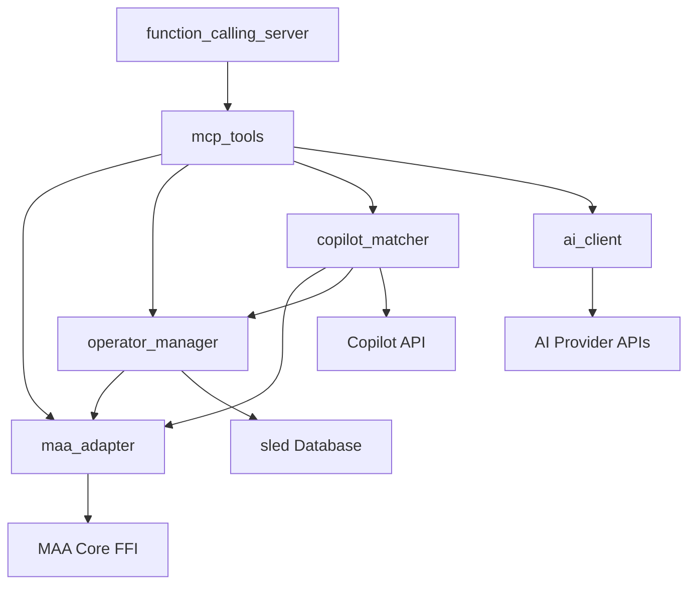

# 模块架构文档

## 模块概览

MAA 智能控制中间层由以下核心模块组成：

```
src/
├── maa_adapter/           # MAA适配器 - MAA Core FFI集成
├── function_calling_server.rs # Function Calling HTTP服务器
├── mcp_tools/             # MCP工具集 - 4个核心工具
├── operator_manager/      # 干员管理器 - 数据扫描和缓存
├── copilot_matcher/       # 作业匹配器 - 智能推荐
└── ai_client/            # AI客户端 - 多提供商支持
```

## 核心模块详解

### 1. MAA适配器 (maa_adapter)

**职责**: 提供 MAA Core 的 Rust FFI 安全包装

**架构**:
```
maa_adapter/
├── mod.rs                  # 模块入口和重导出
├── core.rs                 # 核心适配器实现
├── ffi_wrapper.rs          # 真实 FFI 包装器  
├── ffi_stub.rs             # 开发测试 Stub
├── ffi_bindings.rs         # 本地安全FFI包装器 (编译修复)
├── types.rs                # 类型定义
├── errors.rs               # 错误处理
└── callbacks.rs            # 回调处理
```

**关键特性**:
- ✅ **FFI编译问题修复** - 创建本地安全包装器
- ✅ **双模式架构** - 生产FFI + 开发Stub
- ✅ **线程安全设计** - Send/Sync trait实现
- ✅ **异步回调转换** - tokio兼容

**API示例**:
```rust
let adapter = MaaAdapter::new(config).await?;
let image = adapter.capture_image().await?;
let task_id = adapter.start_task("LinkStart").await?;
let status = adapter.get_task_status(task_id).await?;
```

### 2. Function Calling服务器 (function_calling_server)

**职责**: 提供标准Function Calling HTTP接口

**端点**:
- `GET /tools` - 获取工具列表
- `POST /call` - 执行函数调用
- `GET /health` - 健康检查

**支持格式**:
- OpenAI Function Calling
- Claude Tools
- 标准JSON-RPC
- 自定义格式

### 3. MCP工具集 (mcp_tools)

**职责**: 实现4个核心MCP工具

**工具清单**:

#### maa_command
```typescript
{
  name: "maa_command",
  description: "用自然语言控制MAA",
  parameters: {
    command: "string" // "帮我做日常", "刷10次1-7"
  }
}
```

#### maa_operators  
```typescript
{
  name: "maa_operators", 
  description: "管理干员信息",
  parameters: {
    action: "scan|query|update",
    name?: "string" // 可选干员名称
  }
}
```

#### maa_copilot
```typescript
{
  name: "maa_copilot",
  description: "智能推荐作业", 
  parameters: {
    stage: "string",        // "1-7", "CE-5"
    mode: "simple|level|smart" // 匹配模式
  }
}
```

#### maa_status
```typescript
{
  name: "maa_status",
  description: "获取游戏和任务状态",
  parameters: {} // 无参数
}
```

### 4. 干员管理器 (operator_manager)

**职责**: 干员数据扫描、缓存和查询

**架构**:
```
operator_manager/
├── mod.rs          # 模块入口
├── scanner.rs      # 干员扫描器 (基于MAA识别)
├── cache.rs        # 缓存管理器 (sled数据库)
├── types.rs        # 干员数据类型
└── errors.rs       # 错误处理
```

**核心功能**:
- 🔍 **干员扫描** - 基于MAA图像识别
- 💾 **智能缓存** - sled嵌入式数据库
- 🔄 **增量更新** - 只更新变化的干员
- 📊 **数据分析** - 练度统计和推荐

**API示例**:
```rust
let manager = OperatorManager::new(config).await?;
let result = manager.scan_operators().await?;
let operators = manager.query_operators(&filter).await?;
let summary = manager.get_summary().await?;
```

### 5. 作业匹配器 (copilot_matcher)

**职责**: 智能作业推荐和干员匹配

**架构**:
```
copilot_matcher/
├── mod.rs          # 模块入口
├── matcher.rs      # 三阶段匹配引擎
├── api_client.rs   # 作业站API客户端
├── cache.rs        # 作业缓存管理
└── types.rs        # 匹配数据类型
```

**三阶段匹配**:

#### Stage 1: Simple - 简单匹配
- 检查干员是否存在
- 基础可用性验证
- 快速筛选

#### Stage 2: Level - 等级匹配  
- 检查精英化等级
- 验证干员等级
- 技能等级要求

#### Stage 3: Smart - 智能匹配
- 综合练度分析
- 潜能和信赖度
- 成功率预测
- 智能替换推荐

**评分算法**:
```rust
struct MatchScore {
    total: f64,           // 总分 (0-100)
    operator_match: f64,  // 干员匹配度
    level_confidence: f64, // 练度置信度
    success_rate: f64,    // 预测成功率
}
```

### 6. AI客户端 (ai_client)

**职责**: 多AI提供商统一接口

**支持提供商**:
- OpenAI (GPT-4, GPT-3.5)
- Anthropic (Claude)
- 阿里云 (通义千问)  
- 月之暗面 (Kimi)
- 自定义端点

**统一接口**:
```rust
#[async_trait]
pub trait AiClientTrait {
    async fn chat_completion(&self, messages: Vec<ChatMessage>) -> AiResult<String>;
    async fn function_call(&self, tools: Vec<Tool>) -> AiResult<FunctionCall>;
    async fn stream_chat(&self, messages: Vec<ChatMessage>) -> AiResult<StreamEvent>;
}
```

## 模块依赖关系



## 数据流

### 典型请求流程

```
1. 用户发送自然语言命令 → AI模型
2. AI模型调用 Function Calling → HTTP Server
3. HTTP Server 路由到对应的 MCP Tool
4. MCP Tool 调用业务逻辑模块
5. 业务模块通过 MAA适配器 操作游戏
6. 结果逐层返回给用户
```

### 具体示例: "帮我做日常"

```
用户: "帮我做日常"
  ↓
AI: function_call(name="maa_command", args={"command": "帮我做日常"})
  ↓  
Function Server: POST /call
  ↓
mcp_tools::maa_command::execute()
  ↓
maa_adapter.start_task("LinkStart")
  ↓ 
MAA Core: 执行日常任务
  ↓
返回: {"status": "success", "message": "日常任务已开始执行"}
```

## 配置和部署

### 功能开关

```toml
[features]
default = ["server"]
server = []                # HTTP服务器
with-maa-core = []         # 真实MAA Core集成
stub-mode = []             # 开发测试模式
```

### 环境配置

```env
# 服务器
PORT=8080

# MAA配置  
MAA_RESOURCE_PATH=./maa-official/resource
MAA_LOG_LEVEL=info

# 缓存配置
CACHE_MAX_SIZE=100MB
CACHE_TTL=3600

# AI配置
OPENAI_API_KEY=sk-xxx
CLAUDE_API_KEY=sk-ant-xxx
```

## 测试覆盖

### 测试统计
- **MAA适配器**: 28个测试 ✅
- **干员管理器**: 45个测试 ✅  
- **MCP工具**: 43个测试 ✅
- **作业匹配器**: 39个测试 ✅
- **总计**: 155个测试用例

### 测试类型
- 单元测试 - 每个模块的核心功能
- 集成测试 - 模块间交互
- FFI测试 - MAA Core集成
- HTTP测试 - API端点
- 性能测试 - 响应时间和内存

## 性能指标

### 响应时间
- Function Calling: < 100ms
- 干员扫描: < 2s
- 作业匹配: < 500ms  
- MAA操作: 1-5s

### 资源使用
- 内存占用: < 200MB
- CPU使用: < 10% (空闲)
- 磁盘空间: < 50MB (缓存)

### 并发支持
- HTTP连接: 100个并发
- MAA操作: 串行执行 (MAA限制)
- 缓存操作: 多读单写

## 已知限制

1. **MAA Core依赖** - 需要正确安装MAA Core库
2. **单实例限制** - 同时只能控制一个游戏实例  
3. **Windows优先** - MAA Core对Windows支持最好
4. **内存泄漏** - 长时间运行可能有少量内存泄漏 (FFI相关)

## 未来规划

1. **性能优化** - 减少FFI调用开销
2. **多实例支持** - 支持控制多个游戏实例
3. **Web界面** - 提供图形化管理界面
4. **插件系统** - 支持第三方功能扩展
5. **云端部署** - 支持容器化和云原生部署